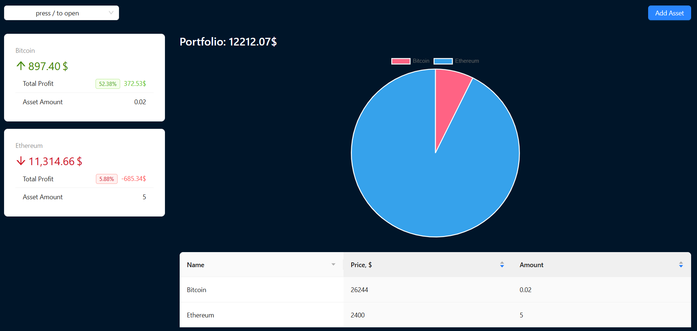
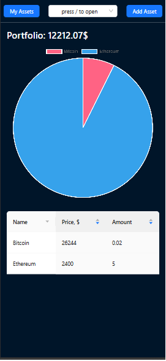

# React Crypto App 📈

[](https://opensource.org/licenses/MIT)

Веб-приложение для отслеживания криптовалютного портфеля с аналитикой и адаптивным интерфейсом





## 🌟 Особенности

- 💼 Обзор портфеля с общей стоимостью
- 📊 Визуализация прибыли/убытков в процентах и абсолютных значениях
- 📱 Полностью адаптивный интерфейс
- 📈 Таблица активов с ключевыми метриками
- ➕ Возможность добавления новых активов

## 🛠 Технологии


- **React** + **Vite** — ядро приложения
- **Ant Design** — UI компоненты
- **React ChartJS 2** — визуализация данных
- Адаптивная верстка (**CSS Media Queries**)

## 🚀 Быстрый старт

1. Клонировать репозиторий:

```bash
git clone https://github.com/Er1argh/react-crypto-app.git
```

2. Установить зависимости:

```bash
npm install
```

3. Запустить приложение:

```bash
npm run dev
```

Приложение будет доступно по адресу: http://localhost:5173

## 📦 Сборка для production

```bash
npm run build
```

## 📌 Планы развития

- Добавление реального API

- Переход на Redux Toolkit

- Добавление функционала

## 🤝 Как помочь проекту

1. Форкайте репозиторий

2. Создавайте ветку для своей фичи (`git checkout -b feature/amazing-feature`)

3. Коммитьте изменения (`git commit -m 'Add some amazing feature'`)

4. Пушите в GitHub (`git push origin feature/amazing-feature`)

5. Открывайте Pull Request

## 📄 Лицензия

Распространяется под лицензией MIT. Подробнее в файле [LICENSE](./LICENSE).

## Сделано с ❤️ и BTC

- 👨💻 Er1argh

- 🌐 [React Crypto App](https://er1argh.github.io/react-crypto-app/)
